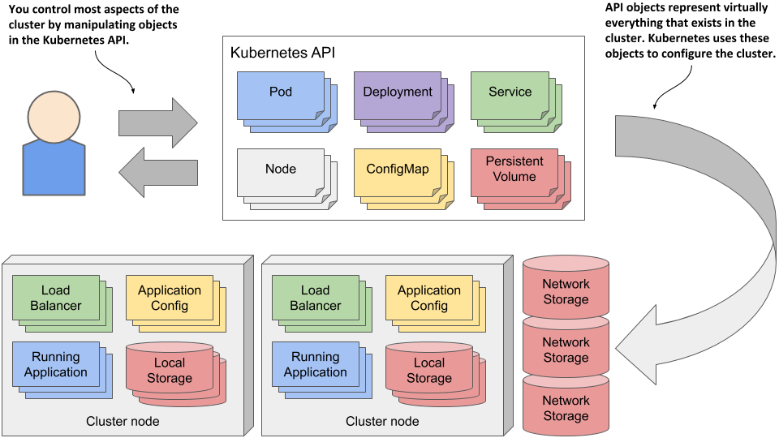

# Kubernetes

1. [Tính năng và kiến trúc của Kubernetes](#feature)
2. [kubectl CLI](#kubectl)
3. [Các đối tượng trong K8s](#objects)

## 1. Tính năng và kiến trúc của Kubernetes <a name="feature"></a>

- *Kubernetes (K8s) là một nền tảng nguồn mở, khả chuyển, có thể mở rộng để quản lý các ứng dụng được đóng gói và các service, giúp thuận lợi trong việc cấu hình và tự động hoá việc triển khai ứng dụng. Kubernetes là một hệ sinh thái lớn và phát triển nhanh chóng. Các dịch vụ, sự hỗ trợ và công cụ có sẵn rộng rãi.*

### 1.1 Tính năng

- **Self-Healing**: Khả năng tự khởi động lại những container bị failed hoặc kills những container không có phản hồi tới container health check endpoint. Duy trì số lương replicas (bản sao pods) mà người dùng đã định nghĩa khi khởi tạo.
- **Secret and configuration management**: Duy trì cấu hình mức ứng dụng và lưu trữ bí mật tại các nơi riêng biệt. Vì thế, các ứng dụng có thể bị thay đổi mà không cần re-building và deploying container.
- **Horizontal scaling**: Dễ dàng để thu gọn/ mở rộng số lượng container với các thao tác command hoặc tự động dựa trên CPU được sử dụng.
- **Automatic bin packing**: Tự động đặt các container vào trong các Worker nodes (các server thực thi) dựa trên số lượng CPU/Memory được chỉ định.
- **Storage orchestration**: Cho phép mount các vùng nhớ local hoặc cloud providers.
- **Automated rollouts and rollbacks**: Cho phép rollout (phát hành) ứng dụng mới bằng cách tạo một container mới mà không tắt container đang vận hành cho đến khi health check xác nhận. Nó sẽ tự động rollback nếu container không có phản hồi tới health check đã được định nghĩa.
- **Service discovery and Load balancing**: Nó hoạt động bằng cách sử dụng Labels, Selectors để chọn được liên kết với Pods và Services, đồng thời có thể sử dụng cân bằng tải trên chúng.

### 1.2. Kiến trúc & các thành phần


*K8s thiết kế dạng cluster. Nó bao gồm 1 master node và ít nhất một worker node. Hỗ trợ nhiều master nodes và worker nodes*

#### 1.2.1. Master Node:

- *Chịu trách nhiệm duy trì toàn bộ trạng thái của Kubernetes cluster và có thể có nhiều hơn 1 master nodes trong cluster để cung cấp khả năng chịu lỗi và tính sẵn sàng cao*
- *Trong đó có chứa nhiều thành phần như Api Server, Controller manager, Scheduler và etcd, Control plane*

1. **API Server**: Là cấu nối duy nhất để tương tác với cluter từ bên ngoài thông qua các REST endpoints được expose ra.
2. **etcd**: Là nơi lưu trữ tất cả dữ liệu cấu hình của hệ thống như: configurations, network activities, .... Lưu trữ dưới dạng key-value.
3. **Scheduler**: Chịu trách nhiệm cho việc lập lịch cho các pod mới dựa trên nodes workload (khối lượng công việc mà các node đang thực hiện). Nó duy trì thông tin tài nguyên về mỗi worker node và phân phối khối lượng công việc phù hợp.
4. **Control manager**: Nó có các quy trình riêng lẻ để duy trì sự ổn định của cluster. 
   a. **Node controller**: Thông báo, phản hồi mỗi khi có node down. 
   b. **Replication controller**: Duy trì số lượng các bản sao của pod dựa trên định nghĩa số lượng bản sao của pod. 
   c. **Endpoints controller**: Công khai các đối tượng endpoint bằng cách sử dụng Labels và Selector của các pods và services. 
   d. **Service Account & Token controller**: Tạo ra các account mặc định và API access tokens cho các namespace mới

#### 1.2.2. Worker Node:

- *Là nơi mà tất cả các pod/container chạy. Nó bao gồm một vào thành phần*

1. **kubelet**: Nó chạy trên mỗi worker node và lấy các thông số kỹ thuật của các pod từ API server, tương tác với container runtime để vận hành start/stop container, mount pod volume và bí mật. 
   Nó giám sát trạng thái của các pod bằng các sử dụng heartbeat messages và chuyển dữ liệu tới master node thông qua API server.
2. **kube-proxy**: Nó là 1 network proxy chạy trên mỗi worker node trong cluster, nó duy trì network rules để cho phép các pod liên lạc với nhau từ bên trong hoặc bên ngoài cluster. 
   Nó điều hướng tới các pod thích hợp dựa trên liên kết service name và Port của request tới.
3. **Container runtime**: Là một phần mềm cần thiết được cài đặt trên mỗi worker node để run container vd: Docker, containerd, .v.v.
4. **Pod**: Nó là nơi mà 1 hoặc nhiều container chạy cùng nhau.

## 2. kubectl CLI <a name="kubectl"></a>

- *Nó là command line interface sử dung cho việc running commands trên K8s cluster master node API server. 
  Nó có file cấu hình được gọi `kubeconfig` cái mà duy trì cluster thông tin cho xác thực và kết nối tới API server.*

### Syntax

```
kubectl [command] [TYPE] [NAME] [flags]
```

1. **command**: Các operations được cho nhận vd: create, apply, get, delete, describe, exec, log,... Tham khảo các loại [Operations](https:-kubernetes.io/docs/reference/kubectl/overview/#operations)
2. **TYPE**: Chấp nhận các loại tài nguyên có dạng số ít, số nhiều hoặc viết tắt, các loại tài nguyên không phân biệt hoa thường. Các loại [resource](https:-kubernetes.io/docs/reference/kubectl/overview/#resource-types) 
   Ví dụ:

```
> kubectl get pod 
> kubectl get pods 
> kubectl get po 
```

3. **NAME**: Sử dụng để chỉ định tên của tài nguyên và nó phân biệt chữ hoa chữ thường. Nếu đặt tên bị sai hoặc trùng, bạn có thể xem chi tiết danh sách các resources bằng ví dụ: ```kubectl get pods```.

```
> kubectl get pod helloworld
> kubectl get pod helloworld helloworld2  
> kubectl get -f ./helloworld.yml 
> kubectl get -f ./helloworld.yml  -f ./helloworld2.yml
```

4. **flags**: Tùy chọn cho mỗi hoạt động. Ví dụ: bạn có thể dùng cờ `-s` or `--server` cho các thông số địa chỉ, port của Kubernetes API server.

> Chú ý: Bạn sử dụng flag đồng nghĩa với việc bạn đã ghi đè lên các thông số mặc định của resource

#### Ví dụ:

- Hiển thị thông tin endpoint về master và service trong cluster
> kubectl cluster-info

- Hiển thị cả kubectl client version và Kubernetes API server version
> kubectl version

- Hiển thị cài đặt cấu hình cluster như contexts, user, ....
> kubectl config view

- Hiển thị danh sách resource trên cluster
> kubectl api-resources

- Hiển thị danh sách thông tin tài nguyên từ default namespace
> kubectl get all

- Hiển thị danh sách thông tin tài nguyên từ tất cả các namespace
> kubectl get all --all-namespaces

- Khởi tạo resource từ file cấu hình
> kubectl create -f ./helloworld.yml

- Khởi tạo resources từ nhiều file cấu hình
> kubectl create -f ./helloworld.yml -f ./helloworld2.yml

- Khởi tạo resource từ folder cấu hình
> kubectl create -f ./dir

- Khởi tạo/ cập nhật tài nguyên từ file
> kubectl apply -f ./helloworld.yml

- Khởi tạo/ cập nhật tài nguyên từ nhiều file
> kubectl apply -f ./helloworld.yml -f ./helloworld2.yml

-  Khởi tạo/ cập nhật tài nguyên từ folder
> kubectl apply -f ./dir

- switch to my-namespace 
> kubectl config set-context --current --namespace=my-namespace

- Danh sách tất cả các pods  trong namespace
> kubectl get pods

- Danh sách pods trong namespace với thông tin thêm
> kubectl get pods -o wide

- Lấy danh sách pod từ yml file
> kubectl get pod my-pod -o yml

- Lấy danh sách các service và deployments cùng nhau
> kubectl get services,deployments

- Hiện thị trạng thái chi tiết của pod
> kubectl describe pods my-pod

- Xóa pod từ file cấu hình my-pod.yml
> kubectl delete -f ./my-pod.yml

- Xóa nhiều pod dựa vào name
> kubectl delete pod pod1 pod2

- Xóa pod với label name=mylabel
> kubectl delete pods -l name=mylabel

- Hiển thị log trong mypod
> kubectl logs mypod

- Stream log từ mypod
> kubectl logs -f mypod

- Thực thi câu lệnh trong container 
> kubectl exec <pod_name> -c <container_name> -- ls

- Truy cập vào command shell của container đầu tiên trong pod
> kubectl exec -it <pod_name> -- /bin/sh 

## 3. Các đối tượng trong K8s <a name="objects"></a>

*Kubernetes objects là các thực thể bền bỉ và được sử dụng đại diện cho trạng thái của Cluster. \
Nó sẽ được tạo ra bằng cách thực thi các script bên trong file cấu hình. \
kubectl command line interface sử dụng để gửi Kubernetes objects tới API server và tạo ra những action cần thiết trong cluster. \
Nhìn chung, chúng ta định nghĩa Kubernetes objects trong file .yml và gửi tới kubectl CLI, Kubectl converts thông tin thành JSON trong khi tương tác với API server.*



### Syntax:

```yaml
apiVersion: v1    # v1, apps/v1, and extensions/v1beta1
kind: Pod   # Pod, Deployment, Service etc.
metadata:
  name: nginx-pod
spec:
```
- **apiVersion**: version của Kubernetes API bạn đang sử dụng để tạo ra object.
- **kind**: Loại đối tượng mà bạn muốn khởi tạo.
- **metadata**: Giúp cho việc định danh đối tượng nó bao gồm, tên, label và namespace (optional).
- **spec**: Nơi mà bạn định nghĩa các trạng thái mong muốn của đối tượng này.

1. **Pod** \
*Là đơn vị cơ bản nhất của Kubernetes cluster. Nó thường chứa 1 hoặc nhiều hơn 1 container. Pod được thiết kế không bền bỉ nó có thể bị xóa bỏ bất cứ lúc nào. Các container trong pod chia sẻ cùng 1 mạng và storage.*

```yaml
apiVersion: v1
kind: Pod
metadata:
  name: first-pod
  labels:
    name: first-pod
spec:
  containers:
    - name: first-pod
      image: hello-world
      ports:
        - containerPort: 8080
```
**spec.containers**: Nó bao gồm, 
- `name`: Tên của container bạn muốn run trong pod.
- `image`: image của ứng dụng bạn muốn run trong pod.
- `ports.containerPort`: Cổng đầu ra ứng dụng của container