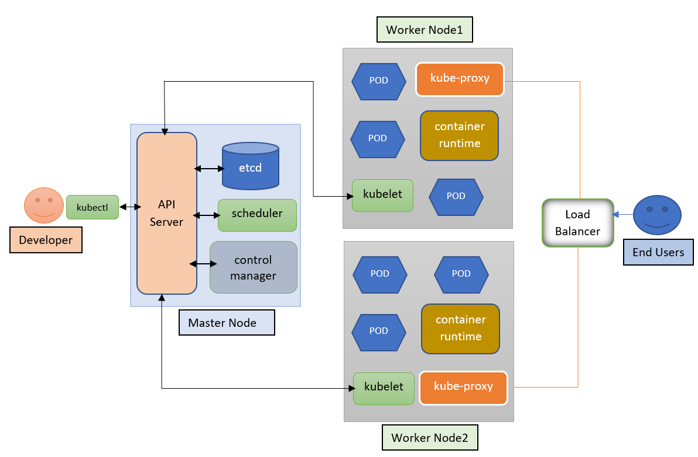
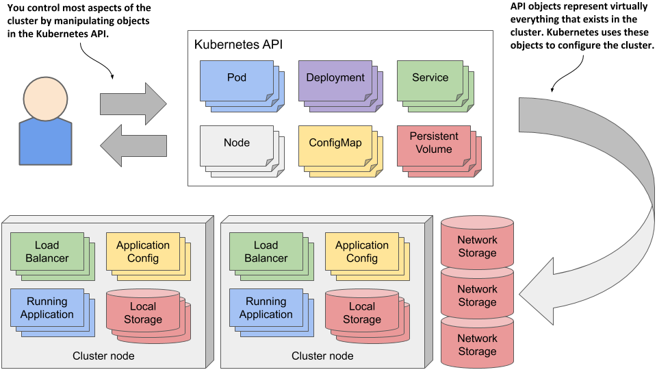
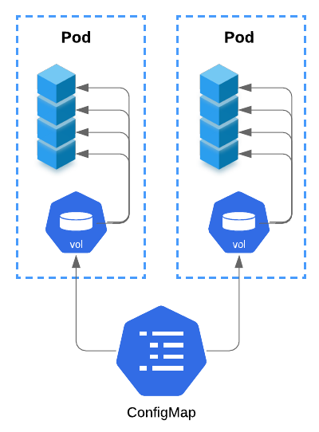
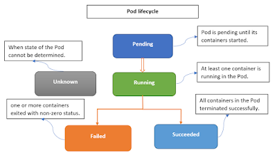

# Kubernetes

1. [Tính năng và kiến trúc của Kubernetes](#feature-ark) \
  1.1 [Tính năng](#feature) \
  1.2 [Kiến trúc & các thành phần](#ark)
2. [kubectl CLI](#kubectl)
3. [Các đối tượng trong K8s](#objects) \
  3.1 [Pod](#Pod) \
  3.2 [ReplicationController](#ReplicationController) \
  3.3 [Replicaset](#Replicaset) \
  3.4 [Deployment](#Deployment) \
  3.5 [Namespace](#Namespace1)\
  3.6 [ConfigMap](#ConfigMap)
4. [Sử dụng câu lệnh vs khai báo yaml để thực thi trong K8s](#Imperative-Declare) \
  4.1. [Các lệnh cơ bản](#Imperative) \
  4.2. [Các khai báo](#Declare)
5. [Các thành phần trong đối tượng của Kubernetes](#componentOfObject) \
  5.1. [Object Name](#objectName) \
  5.2. [Labels](#Labels) \
  5.3. [Selector](#Selector) \
  5.4. [Namespace](#Namespace)
6. [Vòng đời của Pod](#PodLifecycle)

## 1. Tính năng và kiến trúc của Kubernetes <a name="feature-ark"></a>

- *Kubernetes (K8s) là một nền tảng nguồn mở, khả chuyển, có thể mở rộng để quản lý các ứng dụng được đóng gói và các service, giúp thuận lợi trong việc cấu hình và tự động hoá việc triển khai ứng dụng. Kubernetes là một hệ sinh thái lớn và phát triển nhanh chóng. Các dịch vụ, sự hỗ trợ và công cụ có sẵn rộng rãi.*

### 1.1 Tính năng <a name="feature"></a>

- **Self-Healing**: Khả năng tự khởi động lại những container bị failed hoặc kills những container không có phản hồi tới container health check endpoint. Duy trì số lương replicas (bản sao pods) mà người dùng đã định nghĩa khi khởi tạo.
- **Secret and configuration management**: Duy trì cấu hình mức ứng dụng và lưu trữ bí mật tại các nơi riêng biệt. Vì thế, các ứng dụng có thể bị thay đổi mà không cần re-building và deploying container.
- **Horizontal scaling**: Dễ dàng để thu gọn/ mở rộng số lượng container với các thao tác command hoặc tự động dựa trên CPU được sử dụng.
- **Automatic bin packing**: Tự động đặt các container vào trong các Worker nodes (các server thực thi) dựa trên số lượng CPU/Memory được chỉ định.
- **Storage orchestration**: Cho phép mount các vùng nhớ local hoặc cloud providers.
- **Automated rollouts and rollbacks**: Cho phép rollout (phát hành) ứng dụng mới bằng cách tạo một container mới mà không tắt container đang vận hành cho đến khi health check xác nhận. Nó sẽ tự động rollback nếu container không có phản hồi tới health check đã được định nghĩa.
- **Service discovery and Load balancing**: Nó hoạt động bằng cách sử dụng Labels, Selectors để chọn được liên kết với Pods và Services, đồng thời có thể sử dụng cân bằng tải trên chúng.

### 1.2. Kiến trúc & các thành phần <a name="ark"></a>



*K8s thiết kế dạng cluster. Nó bao gồm 1 master node và ít nhất một worker node. Hỗ trợ nhiều master nodes và worker nodes*

#### 1.2.1. Master Node:

- *Chịu trách nhiệm duy trì toàn bộ trạng thái của Kubernetes cluster và có thể có nhiều hơn 1 master nodes trong cluster để cung cấp khả năng chịu lỗi và tính sẵn sàng cao*
- *Trong đó có chứa nhiều thành phần như Api Server, Controller manager, Scheduler và etcd, Control plane*

1. **API Server**: Là cấu nối duy nhất để tương tác với cluter từ bên ngoài thông qua các REST endpoints được expose ra.
2. **etcd**: Là nơi lưu trữ tất cả dữ liệu cấu hình của hệ thống như: configurations, network activities, .... Lưu trữ dưới dạng key-value.
3. **Scheduler**: Chịu trách nhiệm cho việc lập lịch cho các pod mới dựa trên nodes workload (khối lượng công việc mà các node đang thực hiện). Nó duy trì thông tin tài nguyên về mỗi worker node và phân phối khối lượng công việc phù hợp.
4. **Control manager**: Nó có các quy trình riêng lẻ để duy trì sự ổn định của cluster. 
   a. **Node controller**: Thông báo, phản hồi mỗi khi có node down. 
   b. **Replication controller**: Duy trì số lượng các bản sao của pod dựa trên định nghĩa số lượng bản sao của pod. 
   c. **Endpoints controller**: Công khai các đối tượng endpoint bằng cách sử dụng Labels và Selector của các pods và services. 
   d. **Service Account & Token controller**: Tạo ra các account mặc định và API access tokens cho các namespace mới

#### 1.2.2. Worker Node:

- *Là nơi mà tất cả các pod/container chạy. Nó bao gồm một vào thành phần*

1. **kubelet**: Nó chạy trên mỗi worker node và lấy các thông số kỹ thuật của các pod từ API server, tương tác với container runtime để vận hành start/stop container, mount pod volume và bí mật. 
   Nó giám sát trạng thái của các pod bằng các sử dụng heartbeat messages và chuyển dữ liệu tới master node thông qua API server.
2. **kube-proxy**: Nó là 1 network proxy chạy trên mỗi worker node trong cluster, nó duy trì network rules để cho phép các pod liên lạc với nhau từ bên trong hoặc bên ngoài cluster. 
   Nó điều hướng tới các pod thích hợp dựa trên liên kết service name và Port của request tới.
3. **Container runtime**: Là một phần mềm cần thiết được cài đặt trên mỗi worker node để run container vd: Docker, containerd, .v.v.
4. **Pod**: Nó là nơi mà 1 hoặc nhiều container chạy cùng nhau.

## 2. kubectl CLI <a name="kubectl"></a>

- *Nó là command line interface sử dung cho việc running commands trên K8s cluster master node API server. 
  Nó có file cấu hình được gọi `kubeconfig` cái mà duy trì cluster thông tin cho xác thực và kết nối tới API server.*

### Syntax

```
kubectl [command] [TYPE] [NAME] [flags]
```

1. **command**: Các operations được cho nhận vd: create, apply, get, delete, describe, exec, log,... Tham khảo các loại [Operations](https:-kubernetes.io/docs/reference/kubectl/overview/#operations)
2. **TYPE**: Chấp nhận các loại tài nguyên có dạng số ít, số nhiều hoặc viết tắt, các loại tài nguyên không phân biệt hoa thường. Các loại [resource](https:-kubernetes.io/docs/reference/kubectl/overview/#resource-types) 
   Ví dụ:

```
> kubectl get pod 
> kubectl get pods 
> kubectl get po 
```

3. **NAME**: Sử dụng để chỉ định tên của tài nguyên và nó phân biệt chữ hoa chữ thường. Nếu đặt tên bị sai hoặc trùng, bạn có thể xem chi tiết danh sách các resources bằng ví dụ: ```kubectl get pods```.

```
> kubectl get pod helloworld
> kubectl get pod helloworld helloworld2  
> kubectl get -f ./helloworld.yml 
> kubectl get -f ./helloworld.yml  -f ./helloworld2.yml
```

4. **flags**: Tùy chọn cho mỗi hoạt động. Ví dụ: bạn có thể dùng cờ `-s` or `--server` cho các thông số địa chỉ, port của Kubernetes API server.

> Chú ý: Bạn sử dụng flag đồng nghĩa với việc bạn đã ghi đè lên các thông số mặc định của resource

#### Ví dụ:

- Hiển thị thông tin endpoint về master và service trong cluster
> kubectl cluster-info

- Hiển thị cả kubectl client version và Kubernetes API server version
> kubectl version

- Hiển thị cài đặt cấu hình cluster như contexts, user, ....
> kubectl config view

- Hiển thị danh sách resource trên cluster
> kubectl api-resources

- Hiển thị danh sách thông tin tài nguyên từ default namespace
> kubectl get all

- Hiển thị danh sách thông tin tài nguyên từ tất cả các namespace
> kubectl get all --all-namespaces

- Khởi tạo resource từ file cấu hình
> kubectl create -f ./helloworld.yml

- Khởi tạo resources từ nhiều file cấu hình
> kubectl create -f ./helloworld.yml -f ./helloworld2.yml

- Khởi tạo resource từ folder cấu hình
> kubectl create -f ./dir

- Khởi tạo/ cập nhật tài nguyên từ file
> kubectl apply -f ./helloworld.yml

- Khởi tạo/ cập nhật tài nguyên từ nhiều file
> kubectl apply -f ./helloworld.yml -f ./helloworld2.yml

-  Khởi tạo/ cập nhật tài nguyên từ folder
> kubectl apply -f ./dir

- switch to my-namespace 
> kubectl config set-context --current --namespace=my-namespace

- Danh sách tất cả các pods  trong namespace
> kubectl get pods

- Danh sách pods trong namespace với thông tin thêm
> kubectl get pods -o wide

- Lấy danh sách pod từ yml file
> kubectl get pod my-pod -o yml

- Lấy danh sách các service và deployments cùng nhau
> kubectl get services,deployments

- Hiện thị trạng thái chi tiết của pod
> kubectl describe pods my-pod

- Xóa pod từ file cấu hình my-pod.yml
> kubectl delete -f ./my-pod.yml

- Xóa nhiều pod dựa vào name
> kubectl delete pod pod1 pod2

- Xóa pod với label name=mylabel
> kubectl delete pods -l name=mylabel

- Hiển thị log trong mypod
> kubectl logs mypod

- Stream log từ mypod
> kubectl logs -f mypod

- Thực thi câu lệnh trong container 
> kubectl exec <pod_name> -c <container_name> -- ls

- Truy cập vào command shell của container đầu tiên trong pod
> kubectl exec -it <pod_name> -- /bin/sh 

## 3. Các đối tượng trong K8s <a name="objects"></a>

*Kubernetes objects là các thực thể bền bỉ và được sử dụng đại diện cho trạng thái của Cluster. \
Nó sẽ được tạo ra bằng cách thực thi các script bên trong file cấu hình. \
kubectl command line interface sử dụng để gửi Kubernetes objects tới API server và tạo ra những action cần thiết trong cluster. \
Nhìn chung, chúng ta định nghĩa Kubernetes objects trong file .yml và gửi tới kubectl CLI, Kubectl converts thông tin thành JSON trong khi tương tác với API server.*



### Syntax:

```yaml
apiVersion: v1    # v1, apps/v1, and extensions/v1beta1
kind: Pod   # Pod, Deployment, Service etc.
metadata:
  name: nginx-pod
spec:
```
- **apiVersion**: version của Kubernetes API bạn đang sử dụng để tạo ra object.
- **kind**: Loại đối tượng mà bạn muốn khởi tạo.
- **metadata**: Giúp cho việc định danh đối tượng nó bao gồm, tên, label và namespace (optional).
- **spec**: Nơi mà bạn định nghĩa các trạng thái mong muốn của đối tượng này.

3.1. **Pod** <a name="Pod"></a> \
*Là đơn vị cơ bản nhất của Kubernetes cluster. Nó thường chứa 1 hoặc nhiều hơn 1 container. Pod được thiết kế không bền bỉ nó có thể bị xóa bỏ bất cứ lúc nào. Các container trong pod chia sẻ cùng 1 mạng và storage.*

```yaml
apiVersion: v1
kind: Pod
metadata:
  name: first-pod
  labels:
    name: first-pod
spec:
  containers:
    - name: first-pod
      image: hello-world
      ports:
        - containerPort: 8080
```
**spec.containers**: Nó bao gồm, 
- `name`: Tên của container bạn muốn run trong pod.
- `image`: image của ứng dụng bạn muốn run trong pod.
- `ports.containerPort`: Cổng đầu ra ứng dụng của container
3.2. **ReplicationController** <a name="ReplicationController"></a> \
*Được sử dụng để tạo ra nhiều instance giống nhau của pod trong cluster. Nó đảm bảo rằng ở bất cứ thời điểm nào, số lượng pod mong muốn được chỉ định đều ở trạng thái running. Nếu 1 pod stops hoặc dies, `ReplicationController` sẽ tạo mới một cái khác thay thế nó.*

```yaml
apiVersion: v1
kind: ReplicationController
metadata:
  name: myapp
spec:
  replicas: 2
  selector:
    app: myapp
  template:
    metadata:
      name: first-pod
      labels:
        name: first-pod
    spec:
      containers:
        - name: first-pod
          image: hello-world
          ports:
            - containerPort: 8080
```
Ở ví dụ trên có `replicas: 2`: điều này chỉ ra rằng sẽ có 2 pod phải chạy trên cluster. Nếu có bất kỳ 1 pod nào hỏng `ReplicationController` sẽ tạo ra 1 pod mới thay thế ngay lập tức. \
3.3. **Replicaset** <a name="Replicaset"></a> \
*Được nâng cấp từ ReplicationController*

- ReplicationControllers chỉ có thể được tạo trực tiếp bằng cách cấu hình file yaml hay dùng trực tiếp bằng command line với kubectl. Với ReplicaSets, ngoài cách khởi tạo thông thường giống như ReplicationControllers thì còn có thể được tạo ra tự động khi chúng ta khởi tạo một đối tượng Deployment.
- ReplicaSets có thể được cấu hình để áp dụng cho nhiều giá trị labels trong cùng một trường. ReplicationControllers thì chỉ có thể áp dụng cho các Pods có một giá trị cho mỗi trường labels. Ví dụ ReplicaSets có thể áp dụng cho các Pods có labels env=production, env=development, v.v còn ReplicationControllers chỉ áp dụng cho các Pods có labels là env=development chẳng hạn.
```yaml
apiVersion: apps/v1
kind: ReplicaSet
metadata:
  name: frontend
  labels:
    app: guestbook
    tier: frontend
spec:
  replicas: 3
  selector:
    matchLabels:
      tier: frontend
  template:
    metadata:
      labels:
        tier: frontend
    spec:
      containers:
        - name: php-redis
          image: gcr.io/google_samples/gb-frontend:v3
```

3.4. **Deployment** <a name="Deployment"></a> \
*Nó gói lại cả `Replicaset` và `Pod` để cung cấp hàm khai báo cho định nghĩa tài nguyên \
Nó được sử dụng để quản lý các pod và sử dụng Replicaset trong nội bộ để tạo ra số lượng pod \
Được sử dụng đê mở rộng ứng dụng bằng cách tăng số lượng running pods, hoặc cập nhật running application*
```yaml
apiVersion: apps/v1
kind: Deployment
metadata:
  name: nginx-deployment
  labels:
    app: nginx
spec:
  replicas: 3
  selector:
    matchLabels:
      app: nginx
  template:
    metadata:
      labels:
        app: nginx
    spec:
      containers:
        - name: nginx
          image: nginx:1.7.9
          ports:
            - containerPort: 80
```

3.5. **Namespace** <a name="Namespace1"></a> \
*Được sử dụng để nhóm các Kubernetes Objects trong cluster và các action sẽ được thực hiện với namespace.*

- Vd: Create namespace cho các môi trường hoặc Team
```yaml
#For env
apiVersion: v1
kind: Namespace
metadata:
    name: production
#_ _ _

apiVersion: v1
kind: Namespace
metadata:
    name: staging
```
namespace sẽ được đính kèm với mỗi phần metadata trong định nghĩa Kubernetes Object.
```yaml
apiVersion: v1
kind: Pod
metadata:
  name: first-pod
  namespace: staging
  labels:
    name: first-pod
    app: hello-world-app
spec:
```

3.6. **ConfigMap** <a name="ConfigMap"></a> \
*Khi bạn quản lý các ứng dụng Deployment/Pod trong Kubernetes, chắc chắn sẽ có nhu cầu cấu hình các biến môi trường cho Pod hoặc khởi tạo file config cho dịch vụ Container theo cách nào đấy linh động nếu ứng dụng của bạn có mặt ở nhiều môi trường khác nhau như UAT/QA/DEV/TESTING. Thì resource ConfigMap trong Kubernetes vô cùng tiện lợi để hỗ trợ bạn những công việc như vậy.*



**6.1. Sử dụng ConfigMaps** \
Cách thức hoạt động là cấu hình được xác định trong đối tượng ConfigMaps, sau đó được tham chiếu trong Pod (hoặc Deployment).
Dưới đây các cách được dùng thể tạo ConfigMap 
- Sử dụng manifest file
```yaml
apiVersion: v1
kind: ConfigMap
metadata:
  name: simpleconfig
data:
  foo: bar
  hello: world
---
apiVersion: v1
kind: Pod
metadata:
  name: pod2
spec:
  containers:
  - name: nginx
    image: nginx
    env:
      - name: FOO_ENV_VAR
        valueFrom:
          configMapKeyRef:
            name: simpleconfig
            key: foo
      - name: HELLO_ENV_VAR
        valueFrom:
          configMapKeyRef:
            name: simpleconfig
            key: hello
```
Trong manifest trên: 
  - `ConfigMap` có tên simpleconfig chứa hai phần dữ liệu (khóa-giá trị)  — `hello=world` và `foo=bar`
  - `simpleconfig` được tham chiếu bởi một Pod (pod2; các khóa `hello` và `foo` được sử dụng như các biến environment `HELLO_ENV_VAR` và `FOO_ENV_VAR` tương ứng.

**6.2. Sử dụng envVar**
```yaml
apiVersion: v1
kind: ConfigMap
metadata:
  name: config2
data:
  FOO_ENV: bar
  HELLO_ENV: world
---
apiVersion: v1
kind: Pod
metadata:
  name: pod3
spec:
  containers:
  - name: nginx
    image: nginx
    envFrom:
      - configMapRef:
         name: config2
```

**6.3. Dữ liệu cấu hình dưới dạng file** \
*Một cách thú vị khác để sử dụng config data là bằng cách trỏ đến ConfigMap trong phần spec.volumes của thông số Deployment hoặc Pod.*
```yaml
apiVersion: apps/v1
kind: Deployment
metadata:
  name: testapp
spec:
  selector:
    matchLabels:
      app: testapp
  replicas: 1
  template:
    metadata:
      labels:
        app: testapp
    spec:
      volumes:
        - name: config-data-volume
          configMap:
            name: app-config
      containers:
      - name: testapp
        image: testapp
        volumeMounts:
        - mountPath: /config
          name: config-data-volume
```

**6.4. Sử dụng kubectl** 
- Sử dụng `--from-literal` để seed config data
 
 > $ kubectl create configmap config4 --from-literal=foo_env=bar --from-literal=hello_env=world

- Sử dụng `--from-file`
 
 > $ kubectl create configmap config5 --from-file=/config/app-config.properties

- Từ các file trong một thư mục
 
 > $ kubectl create configmap config7 --from-file=/home/foo/config/

## 4. Sử dụng câu lệnh vs khai báo yaml trong K8s <a name="Imperative-Declare"></a>

### 4.1. Các lệnh cơ bản <a name="Imperative"></a>
Syntax: 

``` yaml
kubectl create <objecttype> [<subtype>] <name> : # Tạo các đối tượng trong K8s
kubectl run:  # Tạo ra pod mới để chạy các container
kubectl expose: # Tạo mới các đối tượng dịch vụ tạo định tuyến giữa các pods
kubectl autoscale: # Tạo mới Deployment cho việc tự động mở rộng Pods
kubectl scale: # Thêm/ xóa Pods bằng cách cập nhật đếm số bản sao 
kubectl label: # Thêm hoặc xóa nhãn của đối tượng
kubectl edit: # Sửa cấu hình 
kubectl delete: # Xóa object khỏi cluster
kubectl get: # Lấy ra các thông tin của Object
kubectl describe: # Lấy các thông tin chi tiết của Object
kubectl logs: # Lấy log của các container đang chạy trong pod
```
Ví dụ: 
```
> kubectl create ns testnamespace
> kubectl create deployment nginx --image nginx 
> kubectl create deployment nginx --image nginx 
> kubectl run my-helloworld --image helloworld:1.0
> kubectl get deployment my-helloworld
> kubectl describe deployment my-helloworld
> kubectl label deployment my-helloworld foo=bar
> kubectl expose deployment my-helloworld --port 80 --target-port 3000
> kubectl logs deployment/my-helloworld
> kubectl scale deployment my-helloworld –replicas=2
> kubectl delete deployment/nginx 
```

### 4.2. Các khai báo <a name="Declare"></a>

```yaml
kubectl create -f <filename|url>: # used for creating an object from a specified file
kubectl replace -f <filename|url>: # used for updating a live object from a specified file
kubectl delete -f <filename|url>: # used for deleting an object from a specified file
kubectl get -f <filename|url> -o yaml: # used for viewing info about an object from a specified file
kubectl apply -f <filename|url> : # used for creating/Updating an object from a specified file
kubectl apply -f <directory> : # used for creating/Updating all objects specified in the directory
```
Ví dụ:

```
> kubectl create -f nginx.yaml
> kubectl delete -f nginx.yaml -f redis.yaml
> kubectl replace -f nginx.yaml
> kubectl get -f nginx.yaml -o yaml
```

Cách chuyển từ mệnh lệnh sang khai báo: \
a. Xuất 1 đối tượng đang hoạt động ra file cấu hình:

> kubectl get {`<kind>/<name>`} --export -o yaml > {`<kind>_<name>`}.yaml

Hoặc 

>  kubectl get {`<kind>/<name>`} -o yaml > {`<kind>_<name>`}.yaml

Ví dụ: 
> kubectl get deployments testnginx --export -o yaml > testnginx2.yaml

Hoặc

> kubectl get deployments testnginx -o yaml > testnginx2.yaml 

b. Xóa trạng thái từ file cấu hình.
c. Sử dụng lệnh replace
>   kubectl replace -f `<kind>_<name>`.yaml

Ví dụ:
> kubectl replace -f testnginx2.yaml 

## 5. Các thành phần trong đối tượng của Kubernetes <a name="componentOfObject"></a>
### 5.1 Object Name <a name="objectName"></a>
*Mỗi một object trong Kubernetes đều phải có `Name` phải là duy nhất đối với từng loại tài nguyên trong cùng 1 namespace. Có nghĩa là chúng ta chỉ có 1 Pod có tên "mynginx" trong cùng 1 namespace. Tuy nhiên, chúng ta có thể sử dụng cùng tên cho các loại đối tượng khác nhau như Deployment, Service, Pod, ...* \
Các chú ý cần được tuân thủ khi đặt tên đối tượng trong K8s: 
- Tên không vượt quá 255 ký tự
- Chỉ chứa các ký tự thường chữ hoặc số (a->z), dấu gạch ngang (-), dấu chấm (.)
- Nên bắt đầu/ kết thúc bằng chữ hoặc số.
```yaml
apiVersion: v1
kind: Pod
metadata:
  name: mynginx
spec:
```
### 5.2 Labels <a name="Labels"></a>
*Là cặp key-value được đính kèm trong các object như pods, deployments, etc.*
- Nó hoạt động để phục vụ việc định danh các object trong K8s. Các object khác nhau có thể trao đổi thông qua tên label phù hợp.
- Nó có thể được thêm khi khởi tạo object hoặc cũng có thể sử dụng lệnh để gán vào cho các object đang hoạt động.
- Cùng 1 nhãn có thể được phân chia cho nhiều K8s objects.
- Mỗi key trong Label phải là duy nhất.
- Key, value không vượt quá 63 ký tự các ký tự số, chữ, -, _, . được phép sử dụng để đặt tên key
```yaml
metadata:
  name: pod-label-demo
  labels:
    environment: production
    app: nginx
```
Ví dụ: Tạo labels trong Pod
```yaml
apiVersion: v1
kind: Pod
metadata:
  name: pod-label-demo
  labels:
    environment: production
    app: nginx
spec:
  containers:
    - name: nginx
      image: nginx:1.14.2
      ports:
        - containerPort: 80
```
Tạo labels trong Deployment
```yaml
apiVersion: v1
kind: Deployment
metadata:
  name: deployment-label-demo
  labels:
    environment: production
    app: nginx
spec:
```
Tìm đối tượng dựa vào labels
```
// show all labels on each Pod
> kubectl get pods --show-labels

// show all labels on each Deployment
> kubectl get deployments --show-labels

// show all Pods where label app:nginx
> Kubectl get pods -l app=nginx
// add label to running Pod
// syntax
kubectl label Pod <podname> <key>=<value>

// example
> kubectl label Pod pod-label-demo tier=frontend

// delete Pods using label
> kubectl delete pod -l app=nginx
```
### 5.3 Selector <a name="Selector"></a>
*Nó được sử dụng để nhóm các đối tượng trong K8s và thực thi các hoạt động phù hợp. \
a. Nó được sử dụng trong Deployment để nói chuyện tới các Pods với cặp label cụ thể key/value \
b. Nó được sử dụng trong Service để nộ ra tất cả Pods với cặp label cụ thể key/value*

Ví dụ: Thêm nhãn trên mẫu Pod và thẻ Selector để xác định tất cả các nhãn Pod trong Deployment
```yaml
apiVersion: apps/v1
kind: Deployment
metadata:
  name: my-nginx-deployment 
spec:
  replicas: 2
  selector:
    matchLabels:
      app: nginx
  template:
    metadata:
      labels:
        app: nginx
    spec:
      containers:
        - name: nginx
          image: nginx:1.7.9
          ports:
            - containerPort: 80
```
### 5.1 Namespace <a name="Namespace"></a>
*K8s hỗ trợ nhiều virtual cluster bằng cách sử dụng namespace. Nó hưu ích khi nhiều nhóm sử dụng cùng một cụm với sự tách biệt về Role, Binding và Environments của mỗi nhóm.*
- K8s resource name nên là duy nhất trong 1 namespace, khác namespace thì được.
- Namespace thì không thể lồng vào nhau.
- Mỗi K8s resource chỉ có thể trong 1 namespace.
- Không đặt tên namespace với tiền tố "kube-". Vì nó được dành riêng cho hệ thống K8s.
- Mặc định mỗi resource được tạo ra sẽ nằm trên "default" namespace.

```
// create namespace using Imperative way
> kubectl create namespace my-namespace
```
vs
```yaml
# create namespace using Declarative way
apiVersion: v1
kind: Namespace
metadata:
  name: my-namespace
```
> kubectl create -f my-namespace.yaml

```yaml
# create Pod under my-namespace
apiVersion: v1
kind: Pod
metadata:
  name: my-nginx-pod
  namespace: my-namespace
```
```
// get all namespaces
> kubectl get namespace

// get all Pods with specific namespace
> kubectl get pods –namespace=my-namespace

// delete namespace
> kubectl delete namespace my-namespace

// setting namespace preference for kubectl subsequent commands in the current session
> kubectl config set-context --current --namespace=my-name
```

## 6. Vòng đời của Pod <a name="PodLifecycle"></a>
*Pod là một tập hợp của một hoặc nhiều container với việc chia sẻ lưu trữ và tài nguyên mạng.*
- Network: Pods có 1 địa chỉ IP tự động duy nhất, tất cả các container trong pod sẽ trao đổi với nhau thông qua localhost và Port.
- Storage: Pods có thể được đính kèm tới Volumes cái mà có thể chia sẻ giữa các container.

### *Pod lifecycle*:

Pod được thiết kế không bền bỉ, khi Pod dừng hoạt động nó không thể tự sửa chữa mà bị xóa đi và tạo lại theo chính sách của Pod. \


Vòng đời của Pod đi từ `Pedning`, chuyển qua `Running` nếu có ít nhất 1 container trong nó hoạt động và sau sẽ chuyển qua `Succeded` or `Failed` phụ thuộc vào trạng thái của container trong nó. \
Các trạng thái của Pod được chuyển khi nào?
- Kubelet liên tục quản lý trạng thái của container và gửi thông tin lại cho KubeAPI Server để cập nhật lại trạng thái của Pod.
- Kubelet dừng báo cáo tới KubeAPI Server.

|||
| -----------  | ----------- |
| Pending      | Ở trạng thái này Pod đã được tạo ra bởi cluster, nhưng chưa có container nào được chạy, Giai đoạn này bao gồm thời gian được lên lịch trên một node và tải xuống images|
| Running      | Pod đã được liên kết với một Node và tất cả các container đã được tạo. Ít nhất một container vẫn đang chạy hoặc đang trong quá trình khởi động hoặc khởi động lại.|
| Succeeded	   | Tất cả các container trong Pod đã kết thúc thành công và không khởi động lại        |
| Failed	   | Tất cả các container trong Pod đã kết thúc, có ít nhất một container kết thúc bị lỗi. Đó là, container đã thoát với trạng thái khác 0 hoặc đã bị hệ thống kết thúc.       |
| Unknown		   | Vì một số lý do không thể lấy được trạng thái của Pod. Giai đoạn này thường xảy ra do lỗi trong giao tiếp với nút nơi Pod sẽ chạy.       |

#### Container states:
Cách Kubernetes duy trì các pha Pod, nó duy trì trạng thái của từng container trong Pod. Một lần khi scheduler chỉ định Pod cho Node, kubelet bắt đầu tạo container cho Pod đó. Có 3 trạng thái của container.

|||
| -----------  | ----------- |
|Waiting       | Khi container đang kéo imange, xác nhận dữ liệu bí mật,... |
|Running       | Khi container thực thi mà không có bất kỳ sự cố nào |
|Terminated    | Khi container thoát ra với trạng thái khác 0 |

```
// Create Pod using imperative way
> kubectl run pod-nginx --image=nginx 
```

```yaml
# Create Pod using Declarative way (.yaml file )
apiVersion: v1
kind: Pod
metadata:
  name: pod-nginx
spec:
  containers:
    - name: nginx
      image: nginx:1.14.2
      ports:
        - containerPort: 80
          protocol: TCP
```

```
// Create Pod using Declarative way
> kubectl apply -f ./pod-nginx.yaml


// View all running pods and their status
> kubectl get po

// View specific pod running status
// syntax: kubectl get po <pod-name>
> kubectl get po pod-nginx

// Get running Pod definition
// syntax: kubectl get po <pod-name> -o <outout-format>
> kubectl get po pod-nginx -o yaml

// Get Pod phase
> kubectl get po pod-nginx -o yaml | grep phase

// Describe Pod in-detail
// syntax: kubectl describe po <pod-name>
> kubectl describe po pod-nginx

// View logs from Pod running container
// syntax: kubectl logs <pod-name>
> kubectl logs pod-nginx

// View logs from Pod when multiple running containers
// syntax: kubectl logs <pod-name> -c <container-name>
> kubectl logs pod-nginx -c nginx

// Stream logs from Pod
> kubectl logs -f pod-nginx

// Expose Pod for debugging or testing purpose using port-forward proxy
// Syntax: kubectl port-forward <pod-name> <host-port>:<container-port>
// Ex: http://localhost:8444
> kubectl port-forward pod-nginx 8444:80

// Shell to a running Pod
> kubectl exec -it pod-nginx –-sh

// Shell to specific container when multiple containers running in the Pod
// Syntax: kubectl exec -it <pod-name> --container <container-name> –- sh
> kubectl exec -it pod-nginx --container nginx –-sh

// View last 100 messages from Pod
> kubectl logs --tail=100 pod-nginx

// Delete a Pod
> kubectl delete po pod-nginx
```